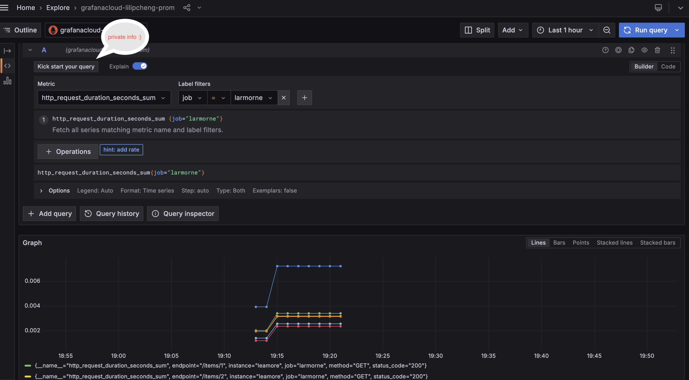

# FastAPI OpenTelemetry Project

## Summary

This project demonstrates how to effectively integrate FastAPI with OpenTelemetry to achieve enhanced observability. By combining FastAPI with OpenTelemetry and Grafana, you gain several advantages:

- **Simplified Instrumentation:** The project includes minimal customized instrumentation with OpenTelemetry, showcasing how easy it is to get started.
- **Flexibility:** The setup allows for flexible and extensible monitoring infrastructure management, enabling easy adjustments and scalability.
- **Enhanced Observability:** Leverage distributed tracing and monitoring to gain deep insights into your application's performance and behavior.
- **Near Real-time Visualization:** Use Grafana dashboards to visualize metrics and traces in real-time, providing quick feedback and alerting capabilities.

## Table of Contents

- [Prerequisites](#prerequisites)
- [Infrastructure Setup](#infrastructure-setup)
- [Seceret management](#secret-management)
-  [oTelCol deployment](#deploy-otel-collector-daemonset)
- [Service Deployment](#service-deployment)
- [Monitoring and Tracing](#monitoring-and-tracing)
- [To do](#to-do)

## Prerequisites

Before you begin, ensure you have the following installed:

- [Terraform](https://www.terraform.io/downloads.html)
- [Docker](https://www.docker.com/products/docker-desktop)
- [GCP SDK](https://cloud.google.com/sdk/install)
- [kubectl](https://kubernetes.io/docs/tasks/tools/)
- [Google Artifactory](https://cloud.google.com/artifact-registry/docs)
- [GCS](https://cloud.google.com/storage/docs)

## Infrastructure Setup

1. **Authenticate with GCP:**
    ```sh
    gcloud auth login
    gcloud auth application-default login
    ```
2. **Set Environment Variables:**

    Export the necessary environment variables for Terraform:
    ```sh
    export TF_VAR_gcp_credentials_json="path/to/your/credentials.json"
    export TF_VAR_project_id="your-gcp-project-id"
    export TF_VAR_region="your-gcp-region"
    ```
3. **Initialize Terraform:**
    ```sh
    terraform init -backend-config="gke-infra/terraform/backend_configs/staging-backend-config.hcl"
    ```

3. **Create Infrastructure:**
    ```sh
    terraform apply -var-file="gke-infra/terraform/envs/staging.tfvars"
    ```

    This will create the necessary GKE cluster, deploy the OpenTelemetry Collector and the Grafana instance.

## Secret Management

Before deploying the FastAPI service, create the necessary secrets to pass them as variables to the service.

1. **Create Secrets** (example using `kubectl`):
    In this repo, all the gke resources are build namespace otel-col. You could use your own namespace, such as monitoring-demo.
    ```sh
    kubectl create secret generic otel-endpoint --from-literal=OTEL_EXPORTER_OTLP_ENDPOINT=<your otel-collector endpoind>
    --namespace=otel-col

    kubectl create secret generic grafana-auth --from-literal=username="<your-grafana-cloud-instant-name>" --from-literal=password="<your grafana access token>" -n <your-name-space>
    ```
    note: the otel-col endpoint is <otel-collector-service-name>.<your-namespace>.svc.cluster.local

## Deploy otel-collector daemonset
    ```
    helm repo add open-telemetry https://open-telemetry.github.io/opentelemetry-helm-charts
    helm install otel-collector open-telemetry/opentelemetry-collector -f values.yaml
    ```
    Verify if the pods are created.
    ```
    ./check_pod_all_logs.sh 
    ```

## Service Deployment

1. **Build and Push Docker Image:**
    ```sh
    docker build --platform linux/amd64 -t fastapi-otel:v2.0 .
    docker tag fastapi-otel:v2.0 <your-artifact-registry-rep>/<your-service-name:version>
    docker push <your-artifact-registry-rep>/<your-service-name:version>
    ```

2. **Deploy to GKE Cluster:**
    Update the `deployment.yaml` file to include the correct image path from Google Artifactory.
    ```sh
    cd gke-infra/deploy/fast_api
    kubectl apply -f deployment.yaml
    ```
    deploy debug pod with traffic simulation script
    ```
    kubectl apply -f alpine-pod.yaml
    kubectl apply -f traffic-simulation-configmap.yaml
    ```
    login to the pod
    ```
    kubectl exec -it apline-curl -n otel-col -- sh
    cd script
    traffic_simulation.sh
    ```
    You should see some 200 and 422 responses from service. To check details you could check the log of the service pod. The metics which we custimised with open-telemetry export also to pod log, for debuging purpose.
    ```
    kubectl logs -f <name-of-fast-api-service-pod>  -n otel-col
    ```

## Monitoring and Tracing

The FastAPI service is instrumented with OpenTelemetry, allowing for distributed tracing and monitoring.

1. **Configure OpenTelemetry Collector:**

    See gke-infra/deploy/otel-collector/values.yaml

2. **Access Metrics in Grafana cloud:**

    Assume you have already Grafana Cloud set up. Stack created, credential set up, enabled OpenTelemetry Connection
    Reference documentation: https://grafana.com/docs/grafana-cloud/send-data/otlp/send-data-otlp/

4. **Configure Grafana Datasource:**
    
    * There will be datasource automatically available based on the connection set in pervious step.
    * For metrics, go to default datasource connection, details see below image.
    

5. **Create Dashboards:**
    You can now create custom dashboards in Grafana to visualize the metrics collected by OpenTelemetry.

## To do

* Set up alert via Grafana API.
* Customised more instrumentation for fastapi as well as for possible backends, such as postgress, redis, rocksdb.
* Migrate all GCP deployment to terraform.
